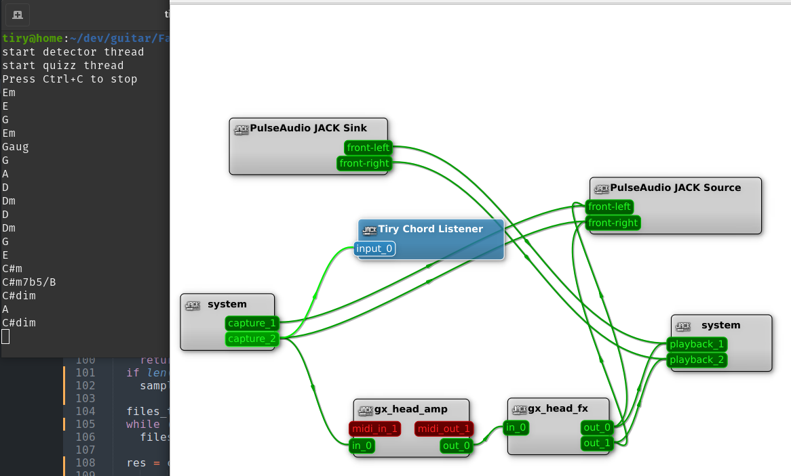

### About

This is a simple python CLI that I wrote to help me learn guitar chords:

 - it use [jack python client](https://github.com/spatialaudio/jackclient-python) to connect to JackD and capture guitar signal
    - it allows me to be able to leverage Guitarix or Ardour as a virtual amp
 - the captured signal is analyzed via [chord-extractor](https://github.com/ohollo/chord-extractor/)
    - extract chords

### Screenshot

### WebChords

WebChords is a simple P5JS SPA for building the list of guitar chords for a given key and fornula:

https://www.delprat.net/guitar/index.html

### References

 - https://docs.scipy.org/doc/scipy/reference/generated/scipy.io.wavfile.read.html
 - https://jackclient-python.readthedocs.io/en/0.4.0/examples.html
 - https://python-sounddevice.readthedocs.io/en/latest/usage.html#recording
 - https://ohollo.github.io/chord-extractor/
